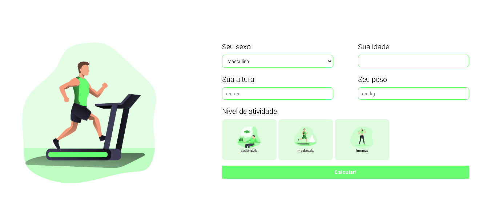
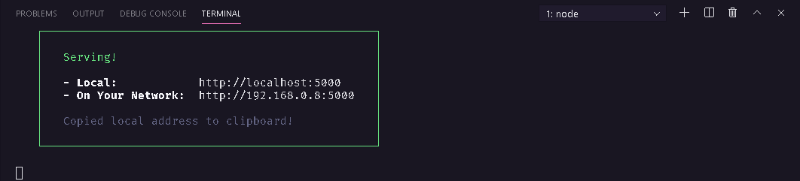

# Calculadora de Metabolismo Basal

Com esta calculadora é possivel calcular, quantas calorias seu corpo precisa para ganhar, perder ou manter o peso.

 
 

### 🚀 Tecnologias
- ✔ HTML
- ✔ CSS
- ✔ JavaScript

SVG's encontradas no site: <a href="https://www.manypixels.co/">Manypixels</a>

## Como testar o projeto:
- Abra o terminal e execute `npm install`
- Depois execute `npx serve .`
- Agora é só abrir o link no navegador

 
